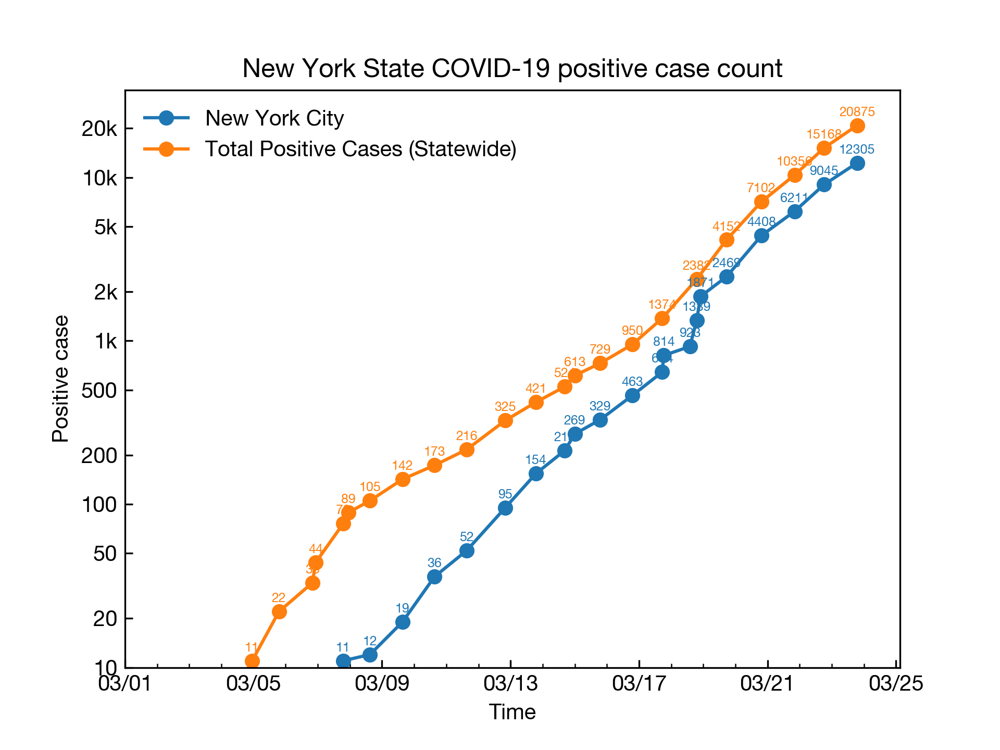
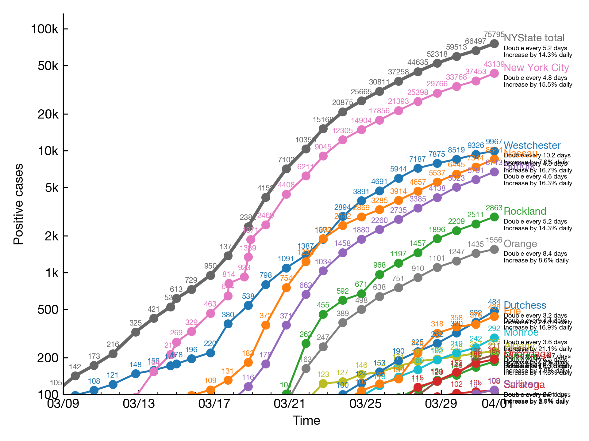
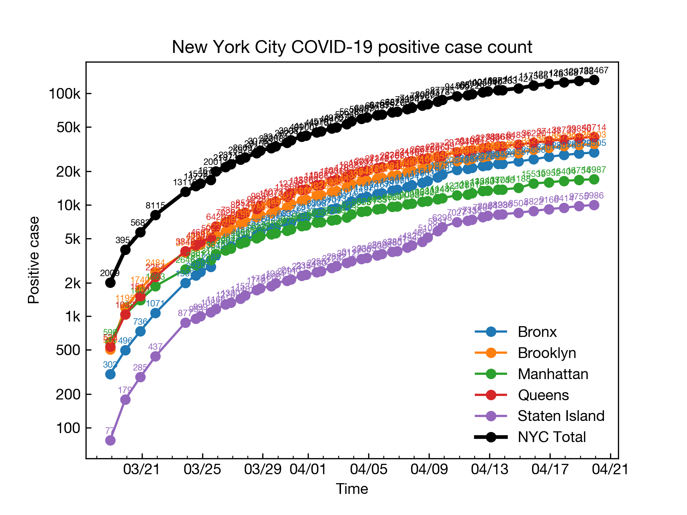
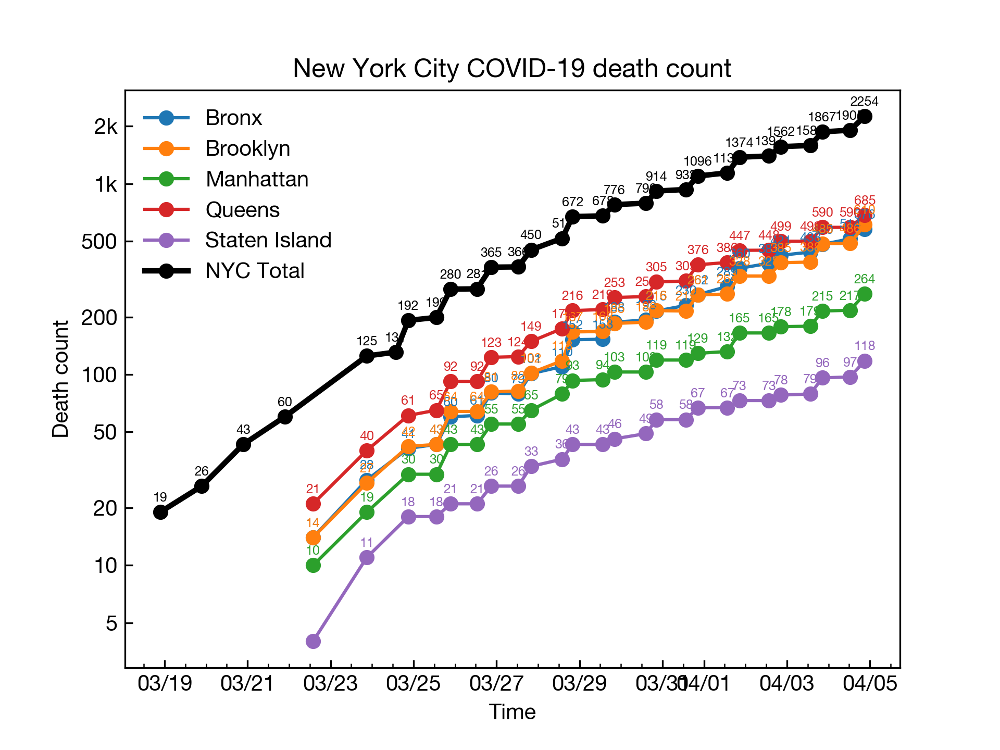
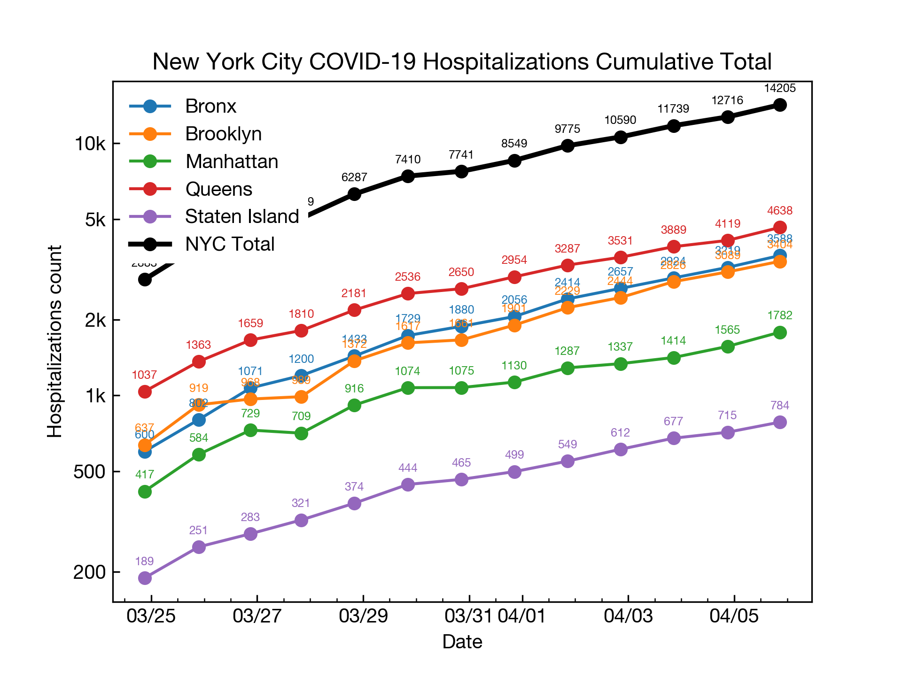
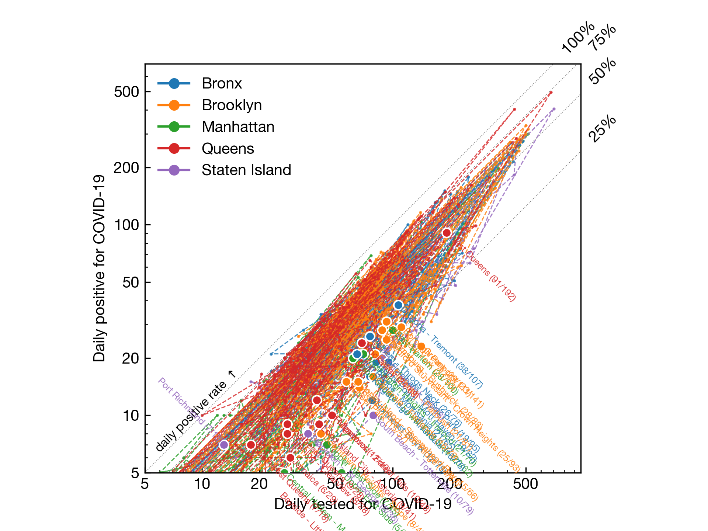
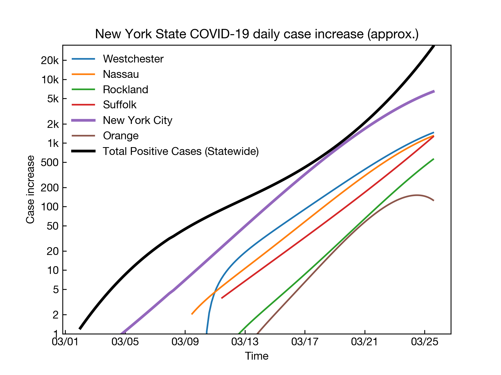
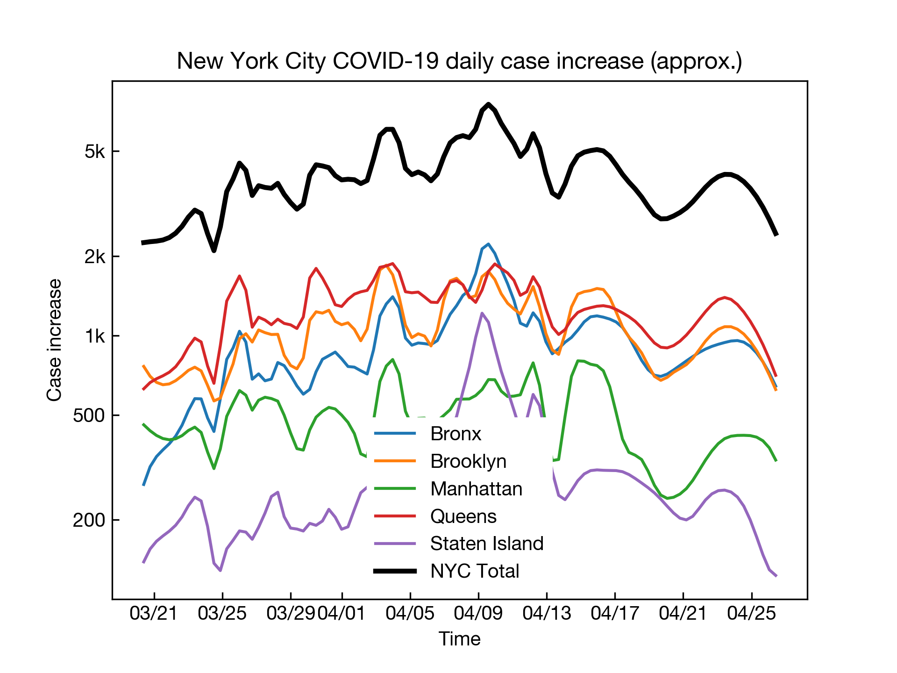

# NYState COVID-19 Tracker

Positive cases tracker for New York State.

## Result

### Total







### NYC daily increase by neighborhood



### An estimation of increacement 





## Usage

### Update

```bash
make update
make update-pdf
make upload
```


## Dependencies

Matplotlib, requests camelot and arrow.