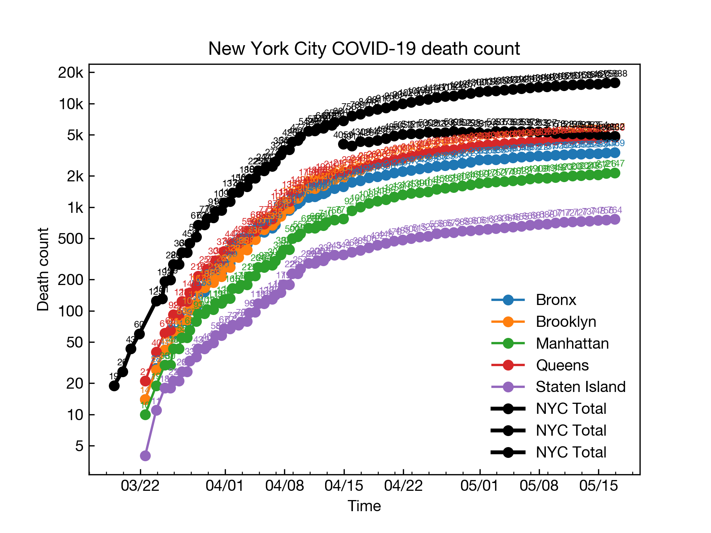
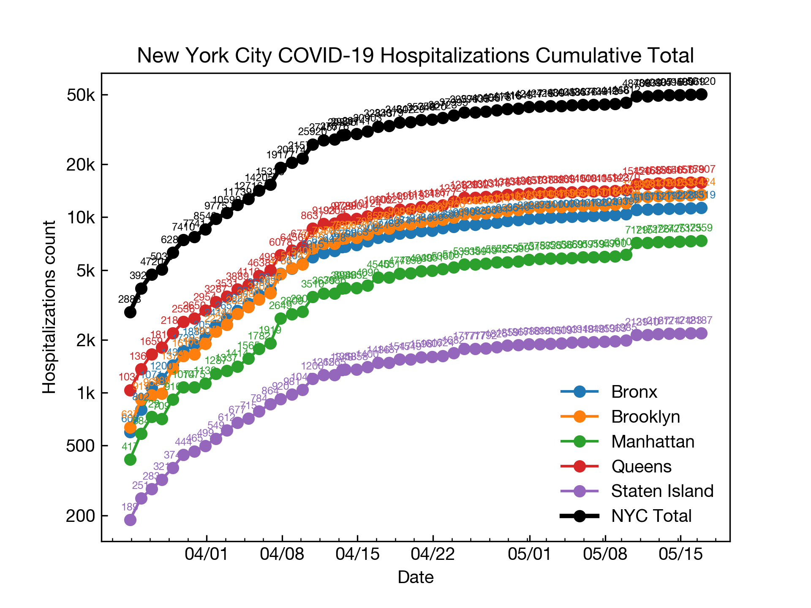
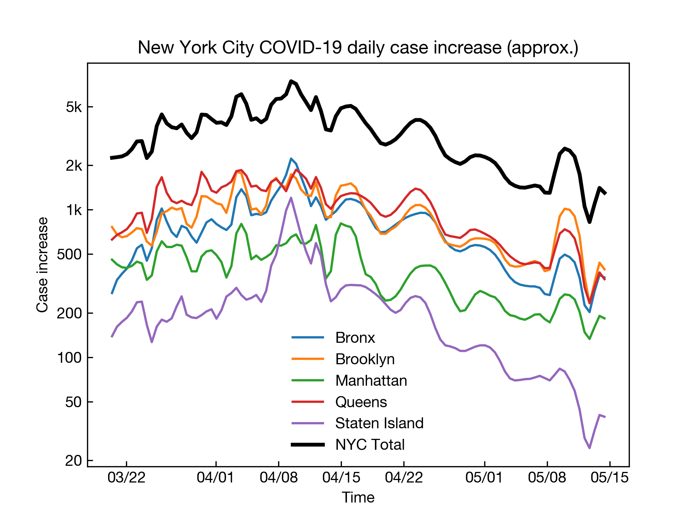

# NYState COVID-19 Tracker

Positive cases tracker for New York State.

## Result

### Total





### NYC daily increase by neighborhood


### An estimation of increacement 




## Usage

### Update

```bash
make update
make update-pdf
make upload
```


## Dependencies

Matplotlib, requests camelot and arrow.